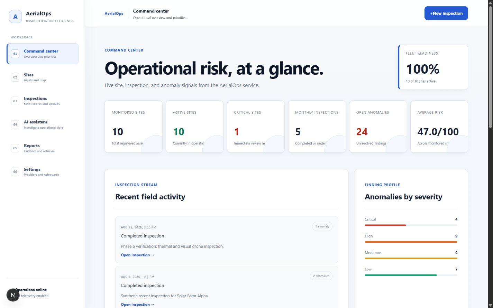
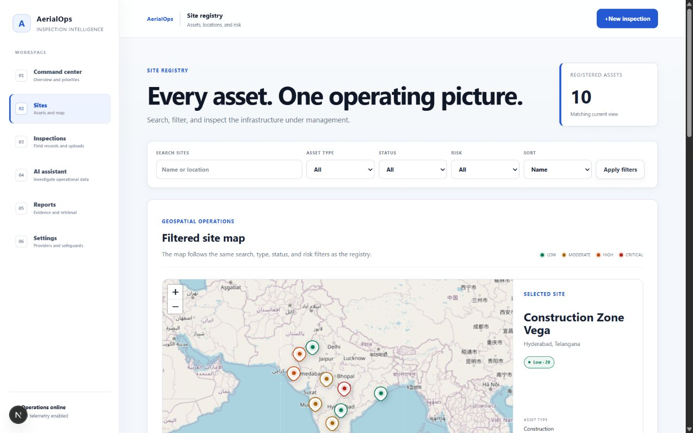
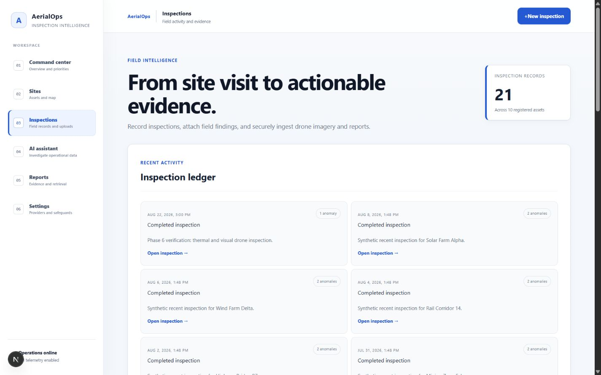
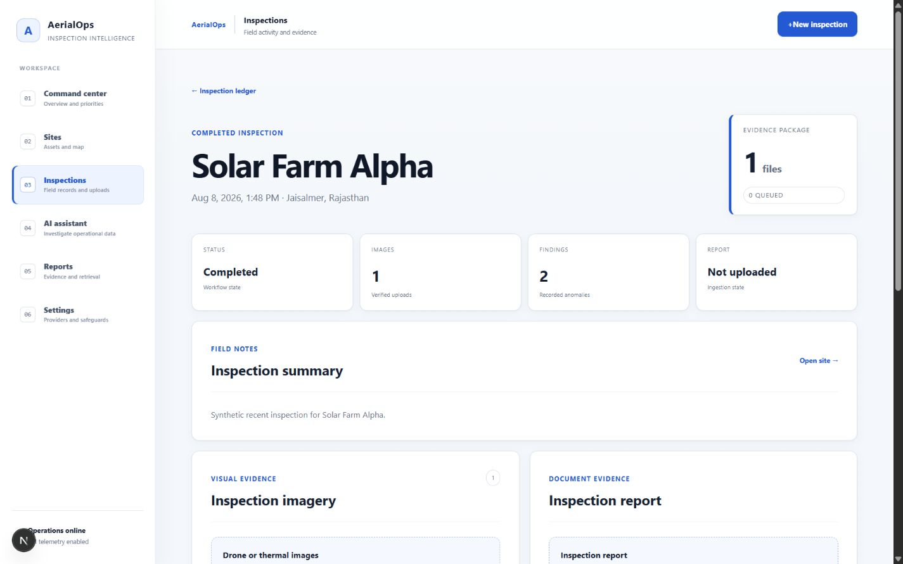
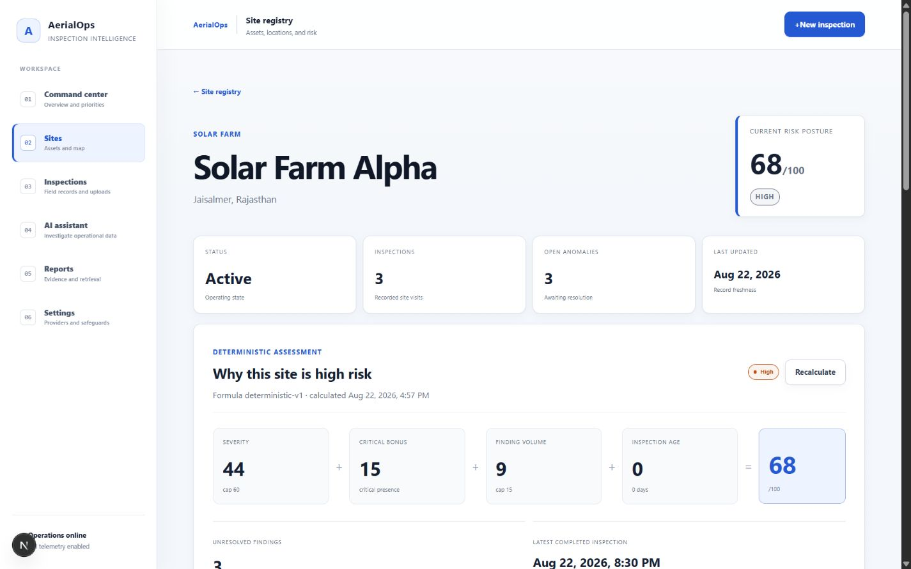
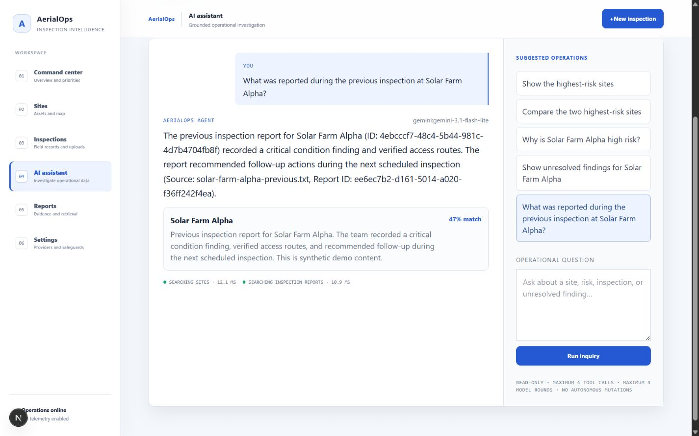
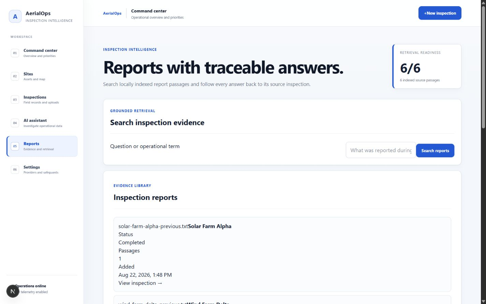
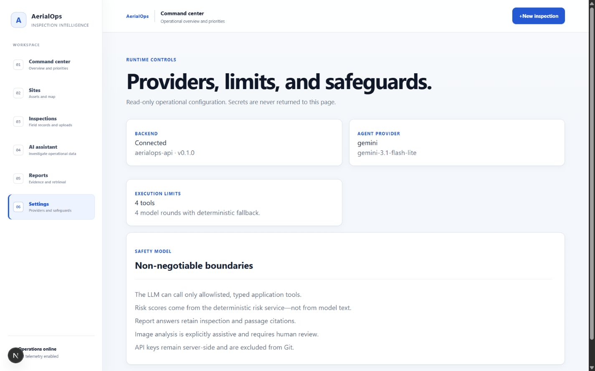
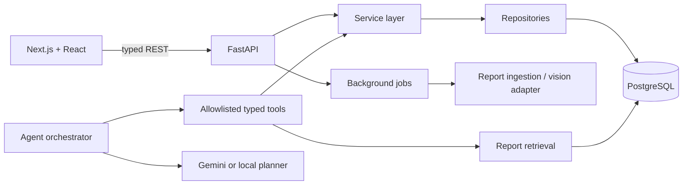
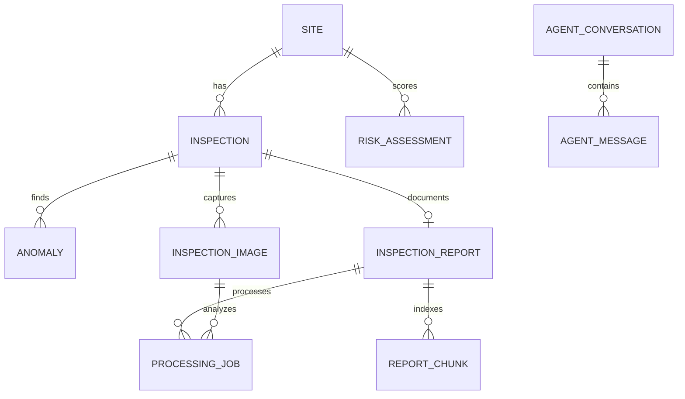

# AerialOps

An AI-assisted drone inspection and geospatial intelligence platform. AerialOps turns synthetic field observations, inspection reports, and anomalies into explainable operational risk and grounded agent answers.

## The problem

Infrastructure teams often have site data spread across reports, imagery, spreadsheets, and mapping tools. AerialOps provides one workflow to create inspections, review findings, understand deterministic risk, search report evidence, and ask a controlled AI agent what needs attention.

## Product capabilities

- Operations dashboard with live metrics, high-risk sites, anomaly trends, and a Leaflet map.
- Site and inspection workflows with validated report and image uploads.
- Explainable `deterministic-v1` risk scoring with immutable assessment history.
- A tool-calling assistant that reads through application services—not raw SQL.
- Multi-tool comparison, deterministic fallback, bounded execution, and visible tool audit.
- Report retrieval with chunking, local embeddings, ranked citations, and agent integration.
- Durable processing-job lifecycle for report indexing and optional AI-assisted image analysis.
- Structured request, tool, provider, and background-job logging without secret/content logging.

## Product screenshots

### Operational command center



### Geospatial site intelligence



### Inspection operations





### Site risk detail



### Grounded AI assistant



### Report retrieval



### Runtime safeguards



## Architecture



The LLM can select only registered tools. Tools validate inputs with Pydantic and call the same services used by REST routes. Authoritative risk is always calculated in Python. Provider failure or timeout falls back to a deterministic local planner.

## Technology

| Layer | Technology |
|---|---|
| Frontend | Next.js 16, React 19, TypeScript, Leaflet |
| API | Python 3.12, FastAPI, Pydantic |
| Persistence | PostgreSQL 16, SQLAlchemy 2, Alembic |
| AI | Gemini REST provider, typed tool calling, deterministic fallback |
| Retrieval | local signed-hash embeddings stored as JSON, cosine ranking, citations |
| Operations | FastAPI BackgroundTasks, structured logs, Docker Compose |

The retrieval implementation deliberately avoids a separate vector database. Its repository boundary can later move to pgvector without changing agent tools or API contracts.

## Core data model



UUID primary keys prevent guessable identifiers. Foreign keys enforce ownership, indexes support common filters, and risk snapshots preserve the formula inputs needed to explain a historical decision.

## Risk engine

`RiskService` calculates a 0–100 score from unresolved anomaly severity, a critical bonus, finding volume, and time since the latest completed inspection. The result is mapped to LOW (0–30), MODERATE (31–60), HIGH (61–80), or CRITICAL (81–100). The formula version and factor snapshot are stored with every assessment.

## Agent and RAG flow

```text
Question → provider/local planner → validated tool call → service/retrieval
         → structured tool result → bounded synthesis → typed UI response
```

Reports are extracted, cleaned into overlapping chunks, embedded locally, and stored with inspection/site metadata. Retrieval embeds the question, ranks chunks by cosine similarity, and returns citations containing the report, inspection, site, excerpt, and score. General-purpose vision is disabled by default and is described only as AI-assisted analysis; findings require human review.

## Run locally

Prerequisites: Python 3.12, Node.js 22+, npm, and PostgreSQL 16+. Docker is an alternative to installing PostgreSQL and the runtimes individually.

Create a development database before starting the backend:

```sql
CREATE ROLE aerialops WITH LOGIN PASSWORD 'aerialops';
CREATE DATABASE aerialops OWNER aerialops;
```

The credentials above are for local development only and match `backend/.env.example`.

Backend:

```powershell
cd backend
python -m venv .venv
.venv\Scripts\Activate.ps1
python -m pip install -e ".[dev]"
Copy-Item .env.example .env
alembic upgrade head
python -m scripts.seed_demo_data
uvicorn app.main:app --reload --port 8000
```

Frontend:

```powershell
cd frontend
npm ci
Copy-Item .env.example .env.local
npm run dev
```

Open `http://127.0.0.1:3000`; API docs are at `http://127.0.0.1:8000/docs`. A `404` at the API root is expected because only documented routes are exposed.

### Gemini (optional)

The application works without an API key. For real model tool selection, set these only in `backend/.env`:

```dotenv
AERIALOPS_AGENT_PROVIDER=gemini
AERIALOPS_GEMINI_API_KEY=your-key
AERIALOPS_GEMINI_MODEL=gemini-2.5-flash
```

Never use a `NEXT_PUBLIC_` variable for secrets. Image analysis remains disabled unless `AERIALOPS_VISION_PROVIDER=gemini` is deliberately enabled.

## Docker

```powershell
docker compose up --build
```

Compose starts PostgreSQL, applies Alembic migrations, then starts the API and frontend. The included password is local-development-only; use managed secrets in a real deployment.

## API overview

- `/api/sites`, `/api/inspections`, `/api/anomalies`: domain CRUD and filters.
- `/api/dashboard/summary`: dashboard aggregation.
- `/api/sites/{id}/risk`: current/history/recalculation.
- `/api/inspections/{id}/images|report|jobs`: ingestion workflow.
- `/api/jobs/{id}` and `/retry`: processing visibility and controlled retry.
- `/api/reports` and `/search`: report ledger and cited retrieval.
- `/api/assistant/query|capabilities|conversations`: controlled agent API.

Errors use stable codes, safe messages, request IDs, and optional validation details.

## Quality checks

```powershell
cd backend
ruff check .
ruff format --check .
pytest
alembic upgrade head --sql

cd ..\frontend
npm run typecheck
npm run lint
npm run build
```

## Demo scenarios

Use this three-minute flow when reviewing the project:

1. Open **Command center** and establish that metrics, recent inspections, anomaly severity, and risk rankings come from the API.
2. Open **Sites**, filter by risk, and select a map marker to connect PostgreSQL coordinates with the Leaflet interface.
3. Create an inspection with anomalies and verify the site risk and dashboard aggregates change deterministically.
4. Ask **“Compare the two highest-risk sites and tell me which should be inspected first.”** Inspect the multiple visible tool calls.
5. Ask **“What was reported during the previous inspection at Solar Farm Alpha?”** Open the returned report citation.
6. Upload a report and inspect its PENDING → PROCESSING → COMPLETED/FAILED processing lifecycle.

## Honest limitations

- Authentication, authorization, tenancy, object storage, antivirus scanning, and rate limiting are not implemented.
- BackgroundTasks is process-local and has no durable worker lease; production should use a queue/worker system.
- Local hash embeddings are deterministic and free but less semantic than a production embedding model; pgvector is the planned storage upgrade.
- Uploaded files use local disk. Large imagery should use signed multipart object-storage uploads.
- General vision output is assistive, not certified defect detection, and remains disabled by default.
- Demo coordinates and data are synthetic and are not real customer assets.

## Documentation

- [Architecture](docs/architecture.md)
- [Data model](docs/data-model.md)
- [API plan](docs/api-plan.md)
- [Interview guide](docs/interview-guide.md)
- [Repository walkthrough](docs/repository-walkthrough.md)
- [Final engineering review](docs/final-engineering-review.md)
- [Phase reports](docs/phases)

## Future improvements

Add identity and tenant-scoped authorization, S3-compatible object storage, a durable worker queue, pgvector/HNSW, retrieval evaluations, browser end-to-end tests, metrics/tracing, and a human-review UI for vision findings before considering production use.
