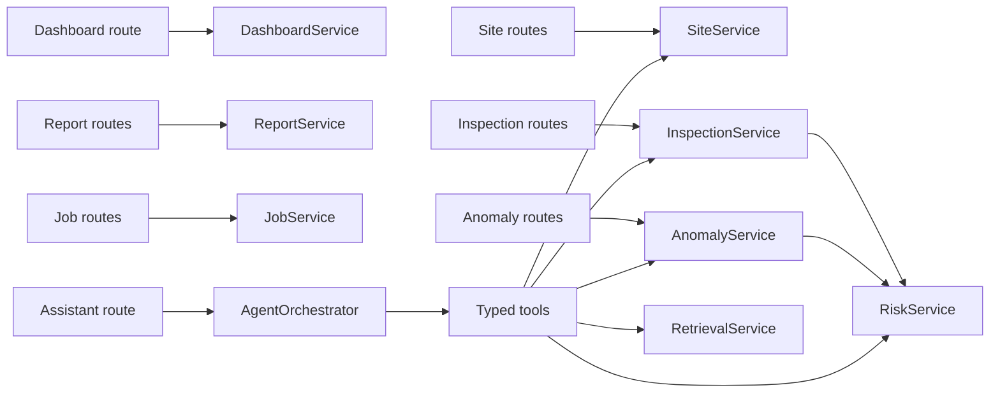

# AerialOps REST API Plan

## 1. API Conventions

Base prefix: `/api` for product endpoints. Health endpoints remain unversioned and minimal. A future breaking public API can adopt `/api/v1`; the MVP avoids version ceremony while contracts are owned by one frontend and backend.

Requests and responses use JSON except multipart upload endpoints. Field names use `snake_case` in the API and matching TypeScript contracts to avoid hidden case-conversion logic.

### Common headers

```text
Content-Type: application/json
X-Request-ID: optional caller value; generated when absent
```

The response returns `X-Request-ID`. Authentication is outside the MVP but the route/service design leaves room for a request user/context dependency.

### Status codes

- `200 OK`: successful read or update/action returning a body.
- `201 Created`: a site, inspection, upload record, conversation, or job was created.
- `204 No Content`: successful deletion where a body adds no value.
- `400 Bad Request`: valid JSON but invalid use-case request or filter combination.
- `404 Not Found`: requested resource does not exist.
- `409 Conflict`: uniqueness or state-transition conflict.
- `413 Payload Too Large`: upload exceeds configured limit.
- `415 Unsupported Media Type`: disallowed file type.
- `422 Unprocessable Entity`: Pydantic request validation failure.
- `500 Internal Server Error`: unexpected internal failure with safe response.
- `503 Service Unavailable`: configured AI provider or dependent service is unavailable.

### Response envelopes

Single-resource endpoints return the resource directly. Collections use:

```json
{
  "items": [],
  "page": 1,
  "page_size": 20,
  "total": 0,
  "has_next": false
}
```

Errors use:

```json
{
  "error": {
    "code": "resource_not_found",
    "message": "The requested resource was not found.",
    "request_id": "request-uuid",
    "details": null
  }
}
```

## 2. Health

| Method | Path | Purpose | Response |
|---|---|---|---|
| GET | `/health` | Process liveness | `200 {"status":"ok"}` |
| GET | `/ready` | Database and required dependency readiness | `200` or `503` with component states |

The frontend connectivity check uses `/health`; operational readiness uses `/ready`.

## 3. Sites

| Method | Path | Purpose | Success |
|---|---|---|---|
| GET | `/api/sites` | Paginated/filterable sites | 200 |
| POST | `/api/sites` | Create a site | 201 |
| GET | `/api/sites/{site_id}` | Site detail with current risk | 200 |
| PATCH | `/api/sites/{site_id}` | Update allowed site fields | 200 |
| GET | `/api/sites/{site_id}/inspections` | Site inspection history | 200 |
| GET | `/api/sites/{site_id}/anomalies` | Site anomaly history | 200 |
| GET | `/api/sites/{site_id}/risk` | Latest assessment/factor breakdown | 200 |
| POST | `/api/sites/{site_id}/risk/recalculate` | Explicit deterministic recalculation | 200 |

### Site list filters

```text
page, page_size (maximum 100)
query (name/location search)
site_type
status
risk_level (repeatable)
inspection_status
min_latitude, max_latitude, min_longitude, max_longitude
sort = name | risk_desc | latest_inspection_desc
```

Bounding-box filters support the map viewport without requiring PostGIS. All four bounds must be supplied together.

### Create site request

```json
{
  "name": "Solar Farm Alpha",
  "site_type": "SOLAR_FARM",
  "location": "Rajasthan, India",
  "latitude": 26.9124,
  "longitude": 75.7873,
  "status": "ACTIVE"
}
```

The server initializes risk to zero/LOW. Duplicate normalized names return `409 site_name_conflict`.

## 4. Inspections

| Method | Path | Purpose | Success |
|---|---|---|---|
| GET | `/api/inspections` | Paginated/filterable inspections | 200 |
| POST | `/api/inspections` | Create inspection and nested anomalies | 201 |
| GET | `/api/inspections/{inspection_id}` | Full inspection detail | 200 |
| PATCH | `/api/inspections/{inspection_id}` | Update status/notes/date | 200 |
| POST | `/api/inspections/{inspection_id}/images` | Register/store validated images | 201 |
| POST | `/api/inspections/{inspection_id}/report` | Register/store one report and job | 201 |
| GET | `/api/inspections/{inspection_id}/jobs` | Processing states for uploads | 200 |

### Inspection list filters

```text
page, page_size
site_id
status
date_from, date_to
sort = inspected_at_desc | inspected_at_asc
```

### Create inspection request

```json
{
  "site_id": "uuid",
  "inspected_at": "2026-08-22T08:30:00Z",
  "status": "COMPLETED",
  "notes": "Routine thermal and visual inspection.",
  "anomalies": [
    {
      "title": "Panel hotspot",
      "description": "Elevated temperature observed in array 3.",
      "severity": "HIGH"
    }
  ]
}
```

The service creates the inspection/anomalies, recalculates risk, stores the assessment, and updates the site snapshot in one transaction. The response includes the new risk summary.

### Upload rules

Uploads use `multipart/form-data`. The server applies configured size/type limits, generates an opaque UUID storage key, records the original filename only as display metadata, and rejects path traversal or content/type mismatches. A report response includes the created `processing_job` so the frontend can show ingestion state.

## 5. Anomalies

| Method | Path | Purpose | Success |
|---|---|---|---|
| GET | `/api/anomalies` | Paginated/filterable cross-site anomalies | 200 |
| POST | `/api/inspections/{inspection_id}/anomalies` | Add finding and recalculate risk | 201 |
| GET | `/api/anomalies/{anomaly_id}` | Get anomaly | 200 |
| PATCH | `/api/anomalies/{anomaly_id}` | Edit or transition anomaly | 200 |

Filters include site, inspection, severity, status, created date, and unresolved-only. Resolving/reopening an anomaly automatically recalculates site risk within the same transaction.

State rules return `409 invalid_anomaly_transition` when violated. `resolved_at` is managed by the service, not trusted from ordinary clients.

## 6. Dashboard

| Method | Path | Purpose | Success |
|---|---|---|---|
| GET | `/api/dashboard/summary` | Metrics and compact dashboard collections | 200 |

Response shape:

```json
{
  "metrics": {
    "total_sites": 10,
    "active_sites": 9,
    "critical_sites": 2,
    "inspections_this_month": 5,
    "unresolved_anomalies": 11,
    "average_risk_score": 47.3
  },
  "recent_inspections": [],
  "highest_risk_sites": [],
  "anomaly_counts_by_severity": {
    "LOW": 2,
    "MODERATE": 4,
    "HIGH": 3,
    "CRITICAL": 2
  }
}
```

The dashboard map obtains full/filterable marker data from `/api/sites`; the summary endpoint stays compact.

## 7. Reports and RAG

| Method | Path | Purpose | Success |
|---|---|---|---|
| GET | `/api/reports` | Paginated report inventory and ingestion state | 200 |
| GET | `/api/reports/{report_id}` | Report metadata and source link | 200 |
| POST | `/api/reports/{report_id}/reprocess` | Create a fresh ingestion job | 201 |
| POST | `/api/reports/search` | Semantic report retrieval for product UI | 200 |

Search request:

```json
{
  "query": "previous inverter damage",
  "site_id": "optional-uuid",
  "inspection_id": null,
  "limit": 5
}
```

Search response items include a bounded excerpt, similarity score, report/inspection/site identifiers, and page/section metadata where available. Full extracted documents are not returned by default.

## 8. Processing Jobs

| Method | Path | Purpose | Success |
|---|---|---|---|
| GET | `/api/jobs/{job_id}` | Poll one processing job | 200 |
| GET | `/api/jobs` | Filter jobs by source/status/type | 200 |
| POST | `/api/jobs/{job_id}/retry` | Future explicit retry for failed job | 201 |

Job representation:

```json
{
  "id": "uuid",
  "job_type": "REPORT_INGESTION",
  "status": "PROCESSING",
  "source": {"report_id": "uuid"},
  "attempts": 1,
  "created_at": "...",
  "started_at": "...",
  "completed_at": null,
  "error": null
}
```

The MVP frontend polls while a visible job is pending/processing. Exponential polling backoff and a timeout prevent indefinite requests.

## 9. Assistant

| Method | Path | Purpose | Success |
|---|---|---|---|
| POST | `/api/assistant/conversations` | Start a conversation | 201 |
| GET | `/api/assistant/conversations/{id}` | Load visible conversation history | 200 |
| GET | `/api/assistant/capabilities` | Report the active planner/model configuration | 200 |
| POST | `/api/assistant/query` | Execute one controlled agent request | 200 |

Query request:

```json
{
  "conversation_id": "optional-uuid",
  "message": "Compare the two highest-risk sites and recommend which to inspect first.",
  "context": {
    "current_site_id": null,
    "visible_map_site_ids": []
  }
}
```

The endpoint has a provider timeout and returns a typed union. A representative comparison response is:

```json
{
  "request_id": "agent-request-uuid",
  "conversation_id": "uuid",
  "response_type": "site_comparison",
  "answer": "Solar Farm Alpha should be inspected first because...",
  "data": {
    "sites": [
      {
        "id": "uuid",
        "name": "Solar Farm Alpha",
        "risk_score": 92,
        "risk_level": "CRITICAL",
        "unresolved_anomalies": 4,
        "latest_inspection_at": "..."
      }
    ],
    "recommended_site_id": "uuid",
    "reasons": ["..."]
  },
  "sources": [],
  "actions": [
    {"type": "OPEN_SITE", "site_id": "uuid"},
    {"type": "HIGHLIGHT_MAP", "site_ids": ["uuid"]}
  ],
  "tool_activity": [
    {"label": "Finding high-risk sites", "status": "COMPLETED"},
    {"label": "Comparing site conditions", "status": "COMPLETED"}
  ]
}
```

`tool_activity` is safe operational metadata, not hidden reasoning. Internal arguments/results can be logged in bounded, redacted form but are not exposed as chain-of-thought.

### Assistant response types

```text
answer
high_risk_sites
site_comparison
inspection_timeline
anomaly_summary
report_summary
clarification
error
```

The frontend uses `response_type` as the discriminant for cards such as `HighRiskSitesCard`, `SiteComparisonTable`, `InspectionTimeline`, `AnomalySummary`, and `ReportSummary`.

### Agent error behavior

- Unknown UUID: tool returns `not_found`; assistant says the site was not found.
- Ambiguous name: `clarification` response lists candidate sites.
- Invalid tool arguments: orchestrator rejects before service execution and allows one corrected call.
- Tool failure: affected tool is marked failed; final answer states that the requested data could not be retrieved.
- Provider timeout/unavailable: endpoint returns `503 ai_provider_unavailable` and conversation remains consistent.
- Malformed final structure: one repair attempt, then a safe structured `error` response.
- Missing report chunks: report response states that indexed report evidence is unavailable; it does not invent content.

## 10. Service Ownership Behind Routes



Routes parse transports and map known exceptions to HTTP. Services own business rules and transactions. Repositories own SQLAlchemy queries. The agent uses the same service capabilities as REST routes, which prevents duplicate business logic.

## 11. Pagination and Performance

The MVP uses page/page-size pagination because it is easy to explain and sufficient for demo data. Collection contracts are designed so keyset cursors can later replace page numbers for large, frequently changing inspection/anomaly lists.

List endpoints select compact response models and avoid loading large report text, image findings, or nested histories. Detail endpoints load bounded related collections. SQL query counts will be tested to avoid N+1 relationships.

## 12. API Test Matrix

Every resource receives happy-path, validation, missing-record, and conflict/state tests. Critical end-to-end API scenarios are:

1. Create a site; verify list/detail/dashboard visibility.
2. Create a completed inspection with anomalies; verify atomic persistence and changed risk.
3. Resolve an anomaly; verify risk recalculation.
4. Upload an invalid and a valid report; verify validation and job state.
5. Query critical sites; verify assistant result matches database facts.
6. Compare top-risk sites; verify multiple registered tools execute.
7. Search a seeded report; verify returned references identify stored chunks.
8. Exercise nonexistent IDs, malformed UUIDs, provider timeout, and tool exception paths.

## 13. Contract Evolution

Pydantic backend schemas and explicit TypeScript frontend types are reviewed together. OpenAPI is the machine-readable source and can later generate client types, but initial handwritten domain types keep the learning surface visible. Breaking changes require coordinated frontend updates and, once external clients exist, a versioned endpoint or additive migration path.
