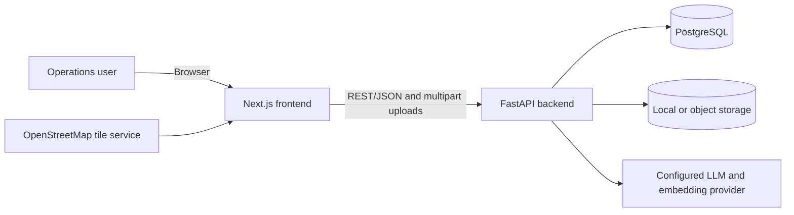
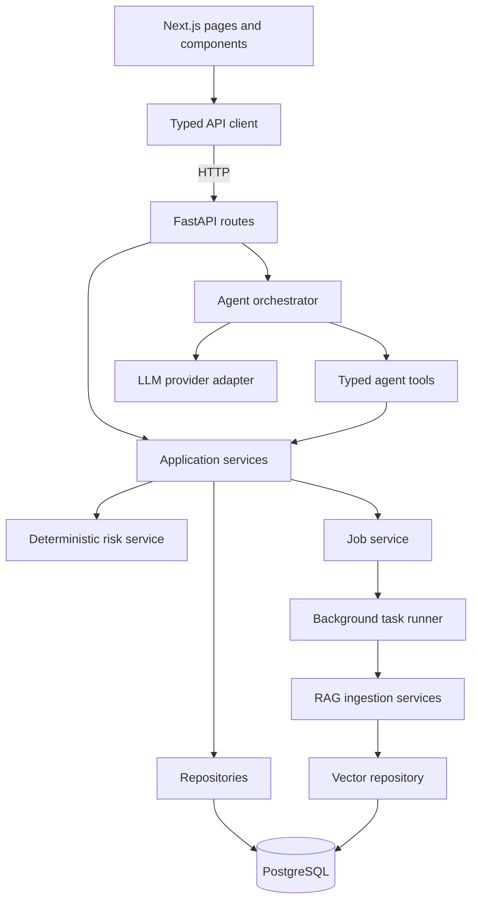
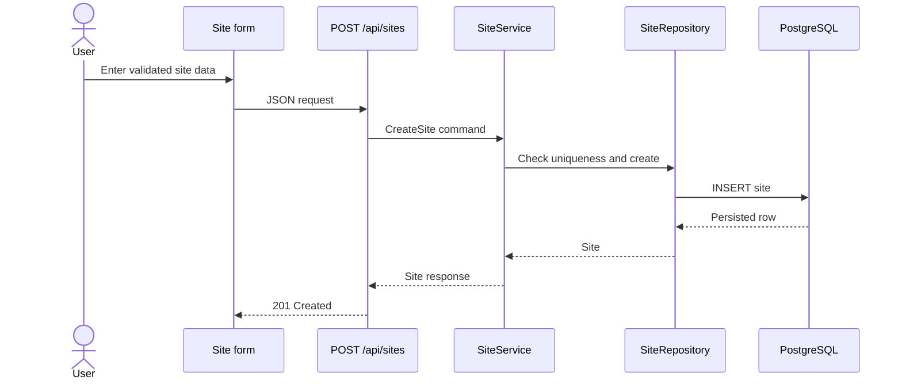
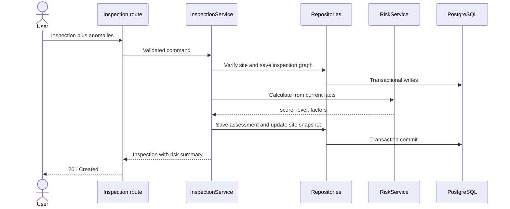
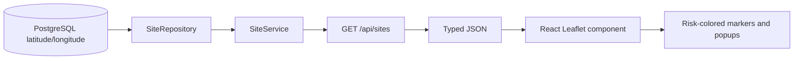
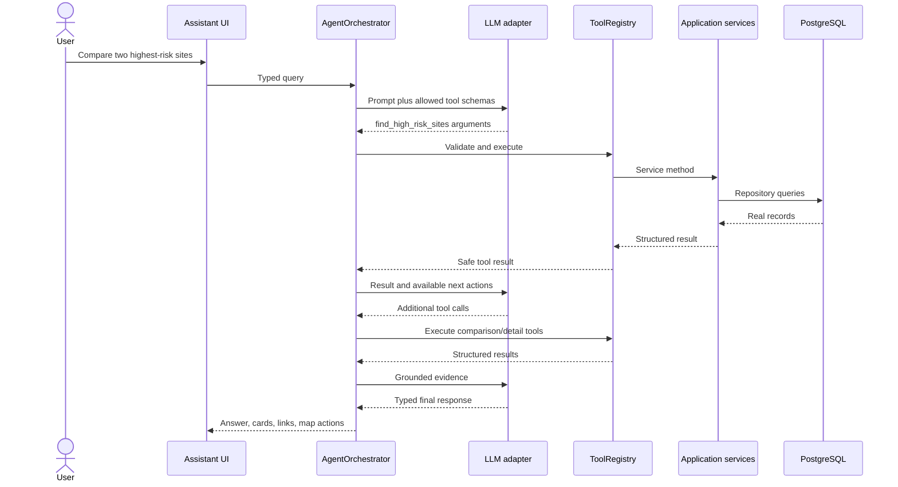
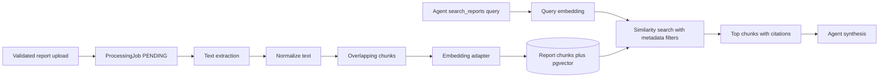
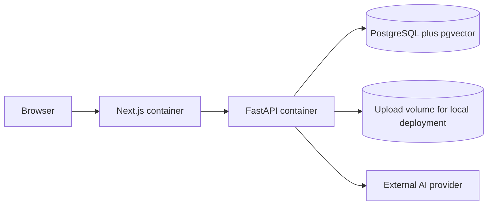

# AerialOps Architecture

## 1. Purpose

AerialOps is an AI-assisted operations platform for managing drone and field-inspection data across infrastructure sites. It combines conventional full-stack workflows—sites, inspections, anomalies, reports, uploads, maps, and risk tracking—with a controlled AI agent that can invoke application capabilities and explain real operational data.

The primary goal is a resume-worthy, interview-defendable MVP. The project favors a modular monolith and explicit data flows over distributed-system complexity.

## 2. Product Requirements

### MVP capabilities

- Create, list, filter, and view infrastructure sites with coordinates.
- Create inspections and attach anomalies to them.
- Recalculate site risk using a deterministic, configurable formula.
- Display real backend data on a dashboard, site pages, and a Leaflet map.
- Ask an AI assistant operational questions using controlled tools.
- Support multi-tool questions such as comparing the two highest-risk sites.
- Return typed assistant responses that the frontend renders as product UI.
- Log HTTP requests, agent requests, tool executions, and background jobs.

### Post-MVP capabilities

- Secure report and image uploads.
- Report ingestion, chunking, embedding, and semantic retrieval.
- Background report ingestion with visible job status.
- AI-assisted image analysis with human review and explicit limitations.
- Docker-based local deployment and expanded test coverage.

### Quality requirements

- Thin HTTP route handlers and testable business services.
- The LLM never receives database credentials and never executes raw SQL.
- Risk scores are deterministic and auditable.
- Uploaded filenames are generated by the server; client filenames are metadata only.
- Pagination is used for growing collections.
- Errors are explicit, structured, logged safely, and converted to appropriate HTTP responses.
- Secrets are supplied through environment variables and never committed.

## 3. Scope and Non-goals

The first version is a single deployable frontend, a single deployable backend, and PostgreSQL. FastAPI background tasks are acceptable for the MVP. Authentication, PostGIS, industrial-grade defect detection, Kafka, Kubernetes, microservices, and automated drone control are not MVP requirements.

PostGIS is intentionally deferred: latitude/longitude storage, bounding-box filtering, and Leaflet visualization do not initially require advanced spatial queries. It can be introduced if radius searches, polygon containment, or spatial indexing become real requirements.

## 4. System Context



The browser communicates only with the FastAPI API for application data. Map tiles are fetched by Leaflet. The backend owns business rules, persistence, safe file handling, agent tools, and provider calls.

## 5. High-level Architecture



### Architectural style

AerialOps is a modular monolith. Modules have clear responsibilities but run in one FastAPI process for the MVP. This provides clean boundaries without the operational cost of microservices.

The core dependency direction is:

```text
HTTP route -> application service -> repository -> PostgreSQL
Agent -> typed tool -> application service -> repository/risk/RAG
```

Routes translate HTTP input and output. Services enforce use-case rules and transactions. Repositories encapsulate query mechanics. Pydantic schemas define external contracts; SQLAlchemy models define persistence.

## 6. Proposed Repository Structure

```text
AerialOps/
├── backend/
│   ├── alembic/
│   ├── app/
│   │   ├── agents/          # orchestration and provider loop
│   │   ├── api/routes/      # thin REST controllers
│   │   ├── core/            # config, logging, errors, middleware
│   │   ├── db/              # engine, sessions, base metadata
│   │   ├── jobs/            # background job runners
│   │   ├── models/          # SQLAlchemy persistence models
│   │   ├── rag/             # loading, chunking, embedding, retrieval
│   │   ├── repositories/    # database access
│   │   ├── schemas/         # Pydantic request/response contracts
│   │   ├── services/        # business use cases
│   │   ├── tools/           # safe agent-facing capabilities
│   │   ├── vision/          # optional image-analysis abstraction
│   │   └── main.py          # application factory/wiring only
│   ├── scripts/             # seed and operational scripts
│   └── tests/
├── frontend/
│   ├── app/                 # Next.js App Router pages
│   ├── components/          # reusable UI and feature components
│   ├── lib/                 # API client, validation, utilities
│   ├── types/               # shared frontend contracts
│   └── public/
├── docs/
├── docker-compose.yml
└── README.md
```

## 7. Core Runtime Flows

### Site creation



### Inspection creation and risk update



Inspection, anomalies, risk assessment, and the site's current risk snapshot are committed in one transaction. A failure rolls back the full use case so the UI cannot observe a partially updated inspection.

### Map data flow



### Controlled multi-tool agent flow



The orchestrator enforces maximum turns/tool calls, validates all arguments and results, handles timeouts, and attaches request IDs. The model chooses only from registered tools. It cannot submit SQL or call repositories directly.

## 8. Agent Architecture

### Responsibilities

- `AgentOrchestrator`: owns the provider/tool-call loop, limits, tracing, and final validation.
- `LLMProvider`: provider-neutral interface for tool-aware completion requests.
- `ToolRegistry`: explicit allowlist mapping tool names to schemas and handlers.
- Tool handlers: validate identifiers and filters, call services, and return serializable results.
- Response schemas: discriminated response types such as answer, high-risk sites, comparison, report summary, or error.

### Initial tool set

```text
get_site_details(site_id)
search_sites(filters)
get_latest_inspection(site_id)
get_inspections(site_id)
get_site_anomalies(site_id)
find_high_risk_sites(limit)
compare_sites(site_a, site_b)
calculate_site_risk(site_id)
search_reports(query, site_id?)
generate_site_report(site_id)
```

### Reliability controls

- Pydantic validates tool arguments before execution and tool results afterward.
- UUID lookup failures become safe `not_found` tool results, not fabricated records.
- Ambiguous site names return candidate matches and ask for clarification.
- Tool exceptions are logged with an agent request ID and converted to safe failures.
- Provider calls have timeouts, bounded retries, and a non-AI fallback message.
- The final provider output is parsed into a discriminated Pydantic response; malformed output is repaired once or rejected safely.
- Tool-call count and orchestration rounds are capped to prevent loops and excess cost.
- No chain-of-thought is stored or returned; only short progress labels and tool audit metadata are exposed.

## 9. Deterministic Risk Architecture

The LLM never computes the authoritative risk score. `RiskService` receives persisted operational facts and returns a score, level, and factor breakdown.

Initial configurable model:

```text
severity_points = sum(unresolved anomaly weights), capped at 60
critical_bonus = 15 when any unresolved CRITICAL anomaly exists
volume_points = min(15, unresolved_count * 3)
recency_points = 0..10 based on days since completed inspection
score = min(100, severity_points + critical_bonus + volume_points + recency_points)
```

Default severity weights:

```text
LOW=2, MODERATE=6, HIGH=12, CRITICAL=20
```

Default recency points:

```text
0-30 days=0, 31-60=3, 61-90=6, over 90 or never inspected=10
```

Classification:

```text
0-30 LOW, 31-60 MODERATE, 61-80 HIGH, 81-100 CRITICAL
```

The exact configuration is versioned in each `RiskAssessment.factor_snapshot`, allowing an interviewer or operator to reconstruct why a historical score was produced.

## 10. RAG Architecture



Each chunk retains report ID, inspection ID, site ID, page/section where available, chunk index, and text. Retrieval can be restricted to a site or inspection. The answer returns references so users can open the underlying report.

`pgvector` is preferred because operational and vector data stay transactionally close in PostgreSQL. A plain-text fallback can keep local development useful when embeddings are not configured, but semantic retrieval is the intended deployment mode.

## 11. Background Processing

The upload request persists the file metadata and a `ProcessingJob` in `PENDING`, commits, and schedules a small background runner. The runner transitions the job through `PROCESSING` to `COMPLETED` or `FAILED` and records a safe error summary.

The background runner calls an application-level processor interface. FastAPI `BackgroundTasks` is the first adapter; a future Celery or RQ adapter can call the same processor. Limitations of the MVP adapter are that jobs are process-local, do not survive a server crash reliably, have no distributed queue, and compete with web traffic for resources.

## 12. Frontend Architecture

- Next.js App Router provides page composition and route segments.
- Server components fetch initial read-only page data where practical.
- Client components own forms, filters, assistant interaction, and Leaflet (which requires the browser DOM).
- A typed API client centralizes the backend base URL, headers, error parsing, and request IDs.
- Feature components render domain contracts; generic components handle loading, error, and empty states.
- URL query parameters hold shareable site/map filters.

Planned pages have working responsibilities:

- `/dashboard`: metrics, map, recent inspections, highest-risk sites, anomaly summary.
- `/sites`: paginated/filterable site list and create flow.
- `/sites/[id]`: site facts, risk, inspection timeline, anomalies, images, reports.
- `/inspections`: inspection list and create flow.
- `/inspections/[id]`: inspection facts, anomalies, uploads, processing jobs.
- `/assistant`: assistant conversation and structured operational result cards.
- `/reports`: searchable report inventory and processing state.
- `/settings`: visible runtime/provider configuration status and risk configuration, without secrets.

## 13. Error Model

REST errors use a consistent shape:

```json
{
  "error": {
    "code": "site_not_found",
    "message": "Site was not found.",
    "request_id": "...",
    "details": null
  }
}
```

Expected domain failures map to 400, 404, or 409. Pydantic validation uses 422. Unexpected failures return 500 with a safe message while the structured log retains diagnostic context. Provider unavailability returns 503. The frontend distinguishes validation, retryable, not-found, and unknown errors.

## 14. Observability

Structured JSON logs include:

- HTTP request ID, method, route template, status, and duration.
- Agent request ID, conversation ID, model name, total duration, and outcome.
- Tool name, duration, success/failure, and safe identifiers.
- Job ID, job type, state transition, duration, and safe error code.
- Provider and database errors without secrets or full uploaded content.

The backend accepts or creates an `X-Request-ID` and returns it in the response. Metrics/traces can be added later without changing business services because timing and correlation live in middleware and orchestration boundaries.

## 15. Security Decisions

- Validate all JSON and tool arguments with Pydantic.
- Restrict file extension, MIME type, and size; inspect content where practical.
- Generate UUID-based storage names and keep uploads outside executable/static code paths.
- Parameterize all database queries through SQLAlchemy.
- Restrict CORS to configured frontend origins.
- Never expose provider keys, database URLs, stack traces, or internal prompts.
- Escape report content and treat it as untrusted data, including prompt-injection instructions.
- Apply pagination, tool-call caps, upload limits, and provider timeouts.
- Add authentication/authorization before real multi-tenant or confidential deployment.

## 16. Deployment Shape



Docker Compose will be the reproducible local deployment. Production would use managed PostgreSQL, object storage, HTTPS, a persistent job queue, centralized logs, health checks, and independently scalable frontend/backend processes.

## 17. Major Technical Decisions

| Decision | Choice | Reason | Revisit when |
|---|---|---|---|
| System shape | Modular monolith | Simple deployment and debuggable boundaries | Teams/modules need independent scaling or release cycles |
| Primary database | PostgreSQL | Relational integrity, transactions, indexing, pgvector option | A proven workload cannot be served efficiently |
| ORM | SQLAlchemy 2.x | Explicit sessions, mature migrations, testability | Not expected for MVP |
| Geospatial MVP | Numeric latitude/longitude | Leaflet mapping needs no spatial extension | Radius/polygon/spatial-index queries matter |
| Risk | Deterministic service | Auditable and testable safety-critical business rule | Formula is replaced by a governed statistical model |
| Agent access | Allowlisted typed tools | Prevents arbitrary data access and constrains hallucinations | New use cases add reviewed tools |
| Vector storage | pgvector | Avoids a second database | Scale/latency evidence justifies a dedicated store |
| Async MVP | FastAPI BackgroundTasks | Minimal infrastructure for small ingestion work | Durability, retries, scheduling, or worker scaling is required |
| API style | REST | Clear resource model and broad interview relevance | Realtime collaboration or streaming creates a concrete need |

## 18. Delivery Order and Phase Gates

Development follows the requested phases. A phase is complete only when its artifacts exist, relevant checks pass, and its teaching report can explain the design and failure behavior. The short-term critical path is:

```text
Architecture -> runnable apps -> persistence -> REST services -> frontend -> map
-> deterministic risk -> tested tools -> LLM orchestration -> assistant UI
```

RAG, durable job evolution, vision, broader tests, Docker, polish, and interview documentation follow after the core MVP flow is stable.
