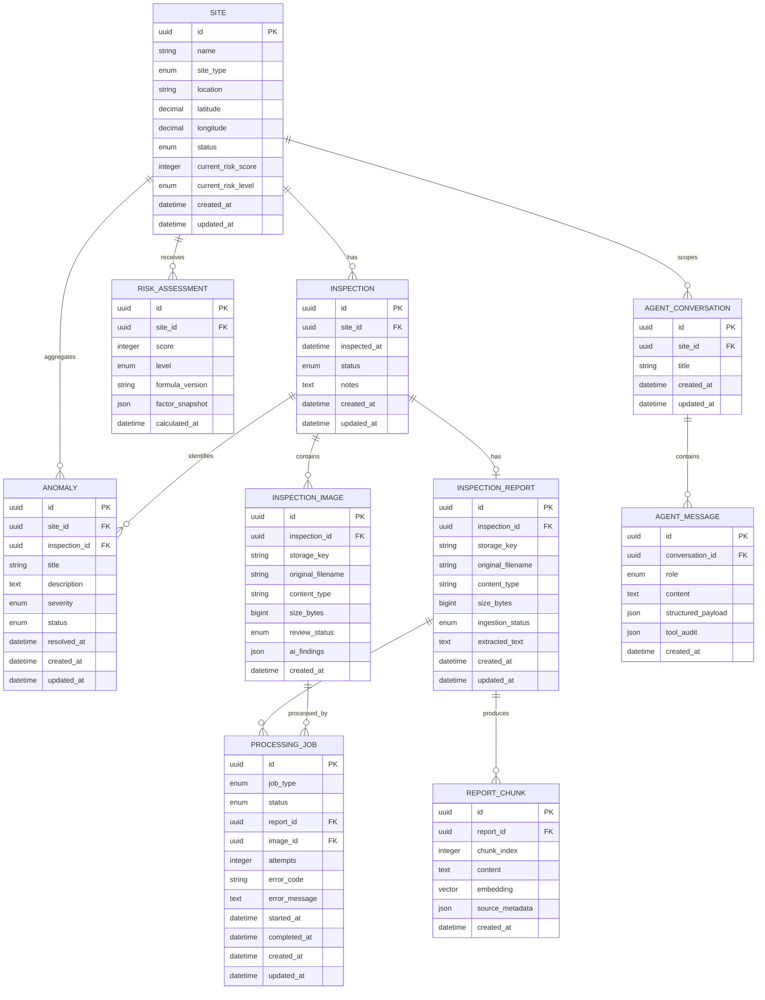

# AerialOps Data Model

## 1. Modeling Goals

The schema stores operational truth independently of the AI layer. It preserves relational integrity, supports the dashboard and agent tools efficiently, and retains enough history to explain inspection and risk decisions.

All primary keys are UUIDs generated by the application. Timestamps are timezone-aware UTC. User-facing times are localized in the frontend. Table and column names use `snake_case`.

## 2. Entity Relationship Diagram



`AgentConversation` is part of the requested domain. `AgentMessage` and `ReportChunk` are supporting entities needed to model conversation history and RAG cleanly.

## 3. Entity Specifications

### Site

Represents an inspected physical location.

| Field | Rule |
|---|---|
| `id` | UUID primary key |
| `name` | Required, 1–150 characters; normalized unique index |
| `site_type` | `SOLAR_FARM`, `WIND_FARM`, `RAIL`, `BRIDGE`, `MINE`, `TRANSMISSION`, `INDUSTRIAL`, `CONSTRUCTION`, `OTHER` |
| `location` | Required human-readable locality, max 255 |
| `latitude` | Decimal, range -90 through 90 |
| `longitude` | Decimal, range -180 through 180 |
| `status` | `ACTIVE`, `INACTIVE`, `MAINTENANCE`, `ARCHIVED` |
| `current_risk_score` | Denormalized latest value, 0–100, default 0 |
| `current_risk_level` | `LOW`, `MODERATE`, `HIGH`, `CRITICAL`, default `LOW` |

The current risk fields are a read-optimized snapshot for maps and dashboards. Historical authoritative calculations remain in `risk_assessments`.

### Inspection

Represents one inspection event at one site.

| Field | Rule |
|---|---|
| `site_id` | Required foreign key to `sites`, delete restricted |
| `inspected_at` | Required timezone-aware date/time, not unreasonably future-dated |
| `status` | `SCHEDULED`, `IN_PROGRESS`, `COMPLETED`, `CANCELLED` |
| `notes` | Optional operational notes with an explicit length limit |

A site may have many inspections. Site deletion is restricted rather than cascading because inspections are operational records.

### InspectionImage

Stores safe metadata for an uploaded image. Binary content is stored on disk for local development and object storage in production.

| Field | Rule |
|---|---|
| `inspection_id` | Required foreign key; delete cascades only when its owning inspection is deliberately deleted |
| `storage_key` | Unique server-generated opaque path/key |
| `original_filename` | Display-only sanitized metadata, never used as a path |
| `content_type` | Allowlisted MIME type |
| `size_bytes` | Positive and below configured limit |
| `review_status` | `NOT_ANALYZED`, `PENDING_REVIEW`, `APPROVED`, `REJECTED` |
| `ai_findings` | Nullable structured JSON from the optional vision adapter |

### Anomaly

Represents a finding from an inspection. Both `site_id` and `inspection_id` are stored: the inspection is the source event; the site key makes operational site-level queries and indexes straightforward. The service enforces that both refer to the same site.

| Field | Rule |
|---|---|
| `severity` | `LOW`, `MODERATE`, `HIGH`, `CRITICAL` |
| `status` | `OPEN`, `ACKNOWLEDGED`, `RESOLVED`, `FALSE_POSITIVE` |
| `resolved_at` | Required only for `RESOLVED`; otherwise null |

An anomaly contributes to risk while unresolved (`OPEN` or `ACKNOWLEDGED`).

### InspectionReport

Stores one uploaded report per inspection in the MVP. A unique constraint on `inspection_id` enforces this. It can later become one-to-many without changing the inspection API shape substantially.

`storage_key`, client filename, MIME type, and byte size follow the same upload rules as images. `ingestion_status` is `NOT_STARTED`, `PENDING`, `PROCESSING`, `COMPLETED`, or `FAILED`. `extracted_text` may be retained for traceability and fallback search, with access controls required for confidential deployments.

### ReportChunk

Stores retrieval units for a report.

- Unique constraint: `(report_id, chunk_index)`.
- `content` stores normalized chunk text.
- `embedding` uses the configured pgvector dimension; migrations must match the selected embedding model.
- `source_metadata` includes page/section, site ID, inspection ID, and extraction details.
- Re-ingestion replaces chunks transactionally to avoid mixing embedding versions.

### RiskAssessment

An immutable record of one deterministic calculation.

- `score`: 0–100.
- `level`: classification derived from the score.
- `formula_version`: e.g. `v1`.
- `factor_snapshot`: severity totals, anomaly IDs/counts, recency, applied weights, and bonuses.
- `calculated_at`: timestamp used to order assessments.

The service inserts an assessment and updates the site snapshot in one transaction.

### ProcessingJob

Tracks asynchronous work independently of the web request.

- `job_type`: `REPORT_INGESTION` or `IMAGE_ANALYSIS` initially.
- `status`: `PENDING`, `PROCESSING`, `COMPLETED`, `FAILED`.
- Exactly one of `report_id` and `image_id` is set, enforced by a check constraint.
- `attempts` starts at zero and supports a future durable queue.
- Error messages are safe summaries, not full provider responses or document content.

Valid state transitions are:

```text
PENDING -> PROCESSING -> COMPLETED
                      -> FAILED
FAILED  -> PENDING (explicit retry in a future queue adapter)
```

### AgentConversation and AgentMessage

A conversation may optionally be scoped to a site. Messages store user-visible content, typed structured response data, and a safe audit of tool names/statuses. Raw chain-of-thought and secrets are never stored.

The message `role` is `USER`, `ASSISTANT`, or `TOOL_STATUS`. Provider-specific payloads are not persistence contracts.

## 4. Relationships and Delete Policy

| Parent | Child | Cardinality | Delete behavior |
|---|---|---:|---|
| Site | Inspection | 1:N | Restrict site deletion |
| Site | Anomaly | 1:N | Restrict site deletion |
| Site | RiskAssessment | 1:N | Restrict site deletion |
| Inspection | InspectionImage | 1:N | Cascade only on explicit inspection deletion |
| Inspection | Anomaly | 1:N | Cascade only on explicit inspection deletion |
| Inspection | InspectionReport | 1:0..1 | Cascade only on explicit inspection deletion |
| InspectionReport | ReportChunk | 1:N | Cascade on report replacement/deletion |
| Report/Image | ProcessingJob | 1:N | Retain while source exists; cascade for deliberate test cleanup |
| AgentConversation | AgentMessage | 1:N | Cascade when a conversation is deliberately deleted |

The application will normally archive sites instead of deleting operational history.

## 5. Index Plan

### Operational indexes

```text
sites(lower(name)) UNIQUE
sites(status, current_risk_level)
sites(site_type)
sites(latitude, longitude)

inspections(site_id, inspected_at DESC)
inspections(status, inspected_at DESC)

anomalies(site_id, status, severity)
anomalies(inspection_id)
anomalies(status, created_at DESC)

risk_assessments(site_id, calculated_at DESC)

processing_jobs(status, created_at)
processing_jobs(report_id)
processing_jobs(image_id)

agent_messages(conversation_id, created_at)
```

### Retrieval index

A pgvector cosine-distance HNSW index is planned for `report_chunks.embedding` after pgvector is enabled and the embedding dimension is fixed. Metadata foreign-key indexes support filtering retrieval by site/report before or alongside similarity ranking.

Indexes are added for demonstrated query paths, not every column. Write cost and index size should be reviewed as data grows.

## 6. Transaction Boundaries

- Create site: uniqueness check and insert in one service transaction, with a unique constraint as the final race-safe guard.
- Create inspection: inspection and nested anomalies are written atomically.
- Recalculate risk: read current facts, insert immutable assessment, and update site snapshot atomically.
- Create inspection plus risk: one transaction for the entire use case.
- Upload registration: file write is coordinated with database persistence; failed persistence removes the newly written file where safe.
- Report re-ingestion: replace chunks and mark report status atomically after successful extraction/embedding.
- Job transitions: conditional updates prevent two workers from claiming the same pending job in a future queue implementation.

## 7. Validation Invariants

- Coordinates remain within world bounds.
- Risk level always matches the score thresholds.
- An anomaly's inspection and site IDs refer to the same site.
- `resolved_at` agrees with anomaly status.
- Completed inspections have an inspection time.
- Server storage keys are unique and cannot contain client-controlled path traversal.
- Exactly one ProcessingJob source is present.
- Report chunks cannot be orphaned or duplicate a chunk index within a report.
- Pydantic handles input validation; database checks and constraints protect invariants against races or non-API writers.

## 8. Demo Data Plan

The idempotent seed command will create at least:

- 10 named synthetic sites across the requested site types and geographic coordinates.
- 20–30 inspections distributed over recent and older dates.
- 15–25 anomalies across every severity and resolution state.
- Several plain-text or generated synthetic reports with searchable facts.
- Risk assessments covering LOW, MODERATE, HIGH, and CRITICAL.

Seed records will use stable identifiers or a seed marker so rerunning does not create duplicates. No confidential or copied operational data is used.

## 9. Migration Strategy

Alembic owns all schema changes. The initial migration creates enum types/tables, constraints, and operational indexes. A separate migration enables the `vector` extension and adds embeddings when pgvector availability is confirmed, keeping the core app runnable in environments without that extension during early phases.

Migration rules:

- Never edit an applied migration; create a new revision.
- Review autogenerated migrations before applying them.
- Test upgrade from an empty database and downgrade where practical.
- Deploy schema changes before code that requires them when compatibility matters.
- Backfill new non-null fields in stages for populated databases.

## 10. Growth Considerations

At one million inspections, retain the same logical model while adding query measurement, selective covering indexes, keyset pagination, table partitioning by inspection date if justified, read replicas for analytics, object storage for files, and asynchronous dashboard aggregation. PostgreSQL remains appropriate until measured constraints indicate otherwise.
